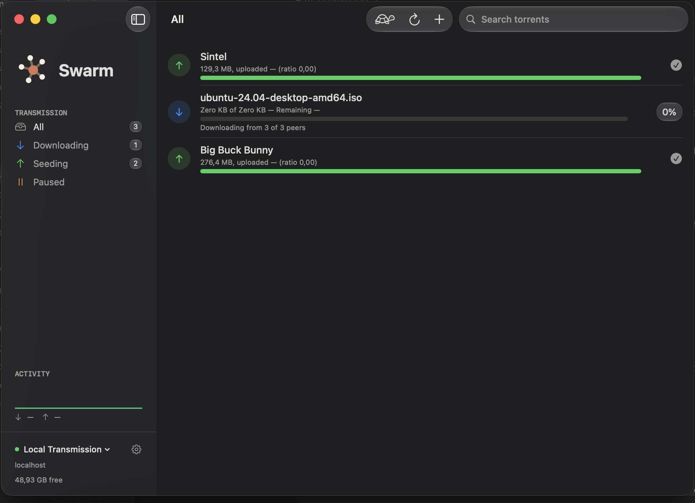
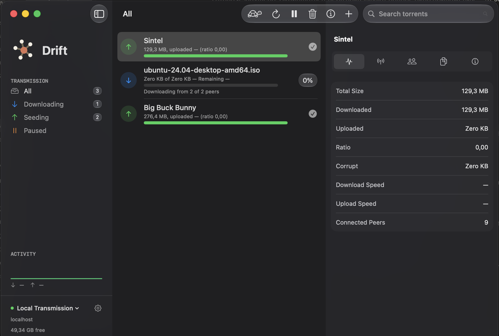
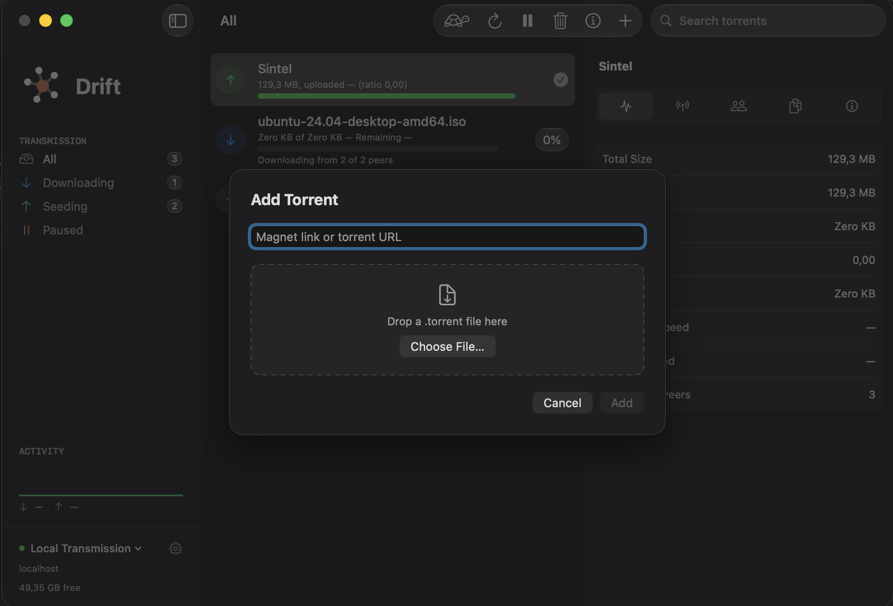

<div align="center">


**A native macOS remote for Transmission.**

[](#requirements)
[](LICENSE)
[](#building)

</div>

---

Drift is a small, fast, entirely native app for controlling a Transmission daemon from your Mac —
on your home server, a NAS, a seedbox, wherever it's running. SwiftUI throughout, Liquid Glass on
macOS 26+, a real toolbar, keyboard shortcuts. It opens instantly, uses almost no memory, and
looks like it belongs on your Mac — because it's built for nothing else.

<p align="center">
  
</p>
<p align="center">
  
  
</p>

## Features

**Torrent management**
- Real-time updates, multi-select with shift/cmd-click, drag-and-drop `.torrent` files straight onto the window
- Add via magnet link, `.torrent` file, or URL — make Drift the default handler for both
- A tabbed inspector per torrent: Activity, Trackers, Peers, Files (with per-file priority and inclusion toggles), General
- Right-click a torrent to ask its tracker for more peers, verify its data on disk, reorder it in the download queue, rename it, move its data to a new location, or copy its magnet link

**Speed control**
- Global upload/download limits
- One-click Slow Mode with its own alternate limits, configurable from a popover

**Built for the Mac**
- Native SwiftUI window with an `.inspector()` side panel, full menu bar commands, and a Dock badge showing active downloads
- Launch at login, keep running quietly in the background after you close the window
- A notification when a download finishes
- English and Russian, following your system language

**At a glance**
- A live sparkline of upload/download throughput in the sidebar
- Torrent counts per filter (All, Downloading, Seeding, Paused)
- Free disk space on the download server

## Requirements

- macOS 14 or later
- A Transmission daemon with remote access (RPC) enabled somewhere on your network

## Building

No Xcode project — Drift is a plain Swift package, built and packaged into a `.app` by one script:

```bash
./script/build_and_run.sh run
```

To produce a distributable, universal (Apple Silicon + Intel) DMG instead:

```bash
./script/build_and_run.sh dmg
```

## Installing a downloaded build

Drift isn't notarized yet — that needs a paid Apple Developer account — so on first launch
Gatekeeper will say it "cannot be opened because it is from an unidentified developer" or "is
damaged and can't be opened." It isn't damaged; macOS just hasn't seen this signature before.
Either:

- **Right-click (or Control-click) the app → Open → Open**, once — macOS remembers your choice after that, or
- Run `xattr -cr /Applications/Drift.app` in Terminal to clear the quarantine flag.

### Signing with a Developer ID (optional)

With a paid Apple Developer account, `dmg`/`release` builds can be signed with a real
certificate instead of ad-hoc — a prerequisite for notarization:

```bash
DEVELOPER_ID_IDENTITY="Developer ID Application: Your Name (TEAMID)" ./script/build_and_run.sh dmg
xcrun notarytool submit dist/Drift-1.0.dmg --keychain-profile "AC_PASSWORD" --wait
xcrun stapler staple dist/Drift-1.0.dmg
```

(`--keychain-profile` assumes credentials already stored once via `xcrun notarytool store-credentials`.)

## Security & privacy

- Server passwords live in the Keychain — never in plaintext preferences.
- The app is sandboxed with Hardened Runtime, and asks for nothing beyond network access and files you explicitly choose.
- Drift talks to Transmission's RPC API over plain HTTP by default, matching Transmission's own defaults, and that traffic never leaves your local network — `NSAllowsLocalNetworking` is the only App Transport Security exception it declares. If your daemon is reachable from outside your LAN, put it behind HTTPS or a VPN; Drift doesn't encrypt RPC traffic itself.
- Nothing is collected, tracked, or sent anywhere except the Transmission server you configure.

## License

MIT — see [LICENSE](LICENSE).
